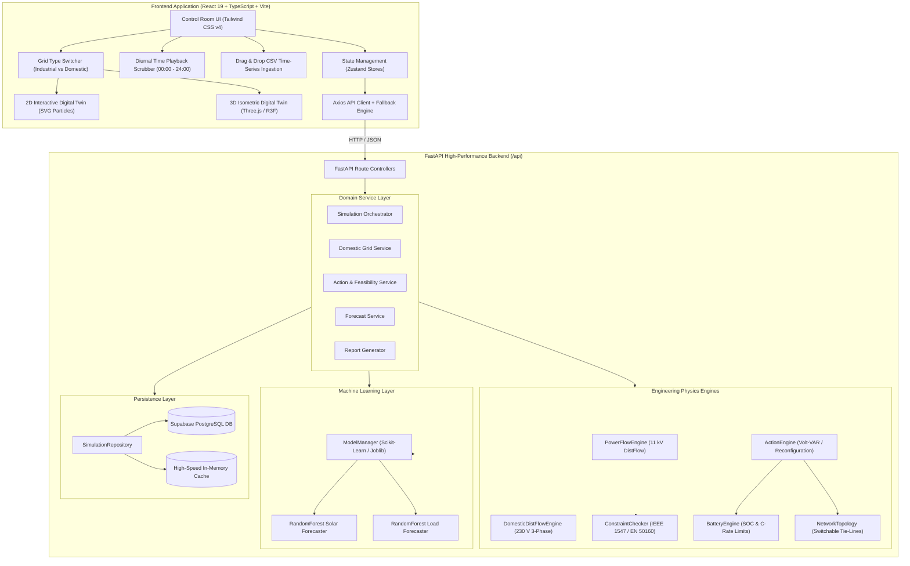

# ⚡ TeamXsparK — Renewable Distribution Grid & Rooftop Solar Digital Twin

[](https://react.dev/)
[](https://fastapi.tiangolo.com/)
[](https://www.python.org/)
[](https://www.typescriptlang.org/)
[](https://threejs.org/)
[](https://tailwindcss.com/)
[](https://standards.ieee.org/)
[](LICENSE)

> **Hackathon Flagship Project**: An industrial-grade, physics-grounded Digital Twin designed to simulate, forecast, and autonomously resolve voltage rise, feeder overload, and phase unbalance caused by high rooftop solar and clean energy penetration.

---

## 📌 Executive Summary: What Is TeamXsparK?

As the world transitions to clean energy, millions of homes and businesses are installing rooftop solar panels, home batteries, and electric vehicle (EV) chargers. However, existing electrical grids were built decades ago for **one-way electricity flow** (from a central power plant down to consumer homes).

When millions of solar rooftops generate electricity simultaneously at sunny noon:
* Power flows in reverse—**from homes back toward the grid substation**.
* This reverse rush acts like high-pressure water pumped backward into pipes, driving **electrical voltage dangerously high** ($> 253\text{ V}$ or $> 1.05\text{ pu}$).
* Neighborhood power cables and transformers overheat past $100\%$ capacity.
* Power companies are often forced to shut down solar panels, **wasting clean renewable electricity**.

### 💡 The Solution: TeamXsparK Digital Twin
**TeamXsparK** provides a real-time, interactive **"Flight Simulator" for the modern renewable power grid**. 

Instead of guessing or manually inspecting physical equipment, operators and energy planners use TeamXsparK to:
1. **Model & Visualize**: See electricity flow in real-time across both **11 kV utility feeders** and a **230 V residential neighborhood of 8 solar homes** in both interactive 2D schematics and 3D isometric WebGL views.
2. **Forecast with AI**: Use Machine Learning (Random Forest) models to predict tomorrow’s solar production and household demand 24 hours in advance.
3. **Simulate Real Physics**: Run true AC DistFlow electrical equations calculating voltage drops, branch heating, line losses, and phase unbalance.
4. **Autonomous Voltage Control**: Automatically activate smart inverter controls (Volt-VAR droop) to absorb excess electrical pressure and direct surplus solar into parked electric cars or home batteries—**stabilizing the grid without wasting a single watt of green solar power**.
5. **Physical Feasibility Checking**: Ensure that recommended actions are practically possible by evaluating real battery state-of-charge (SOC) limits, refusing to hallucinate impossible fixes if a battery is depleted ($\le 20\%$).

---

## 📑 Table of Contents

- [1. The Core Problem in Everyday Terms](#1-the-core-problem-in-everyday-terms)
- [2. Key Novelties & Hackathon Highlights](#2-key-novelties--hackathon-highlights)
- [3. Real-World Use Cases](#3-real-world-use-cases)
- [4. Dual Digital Twin Models](#4-dual-digital-twin-models)
  - [Model 1: 11 kV Industrial Medium-Voltage Grid](#model-1-11-kv-industrial-medium-voltage-grid)
  - [Model 2: 230 V Domestic Rooftop Solar Neighborhood](#model-2-230-v-domestic-rooftop-solar-neighborhood)
- [5. System Architecture & Data Flow](#5-system-architecture--data-flow)
- [6. Mathematical Foundations & Physics Engine](#6-mathematical-foundations--physics-engine)
- [7. Machine Learning Forecasting Pipeline](#7-machine-learning-forecasting-pipeline)
- [8. Technology Stack](#8-technology-stack)
- [9. Project Structure](#9-project-structure)
- [10. Step-by-Step Installation & Quick Start](#10-step-by-step-installation--quick-start)
- [11. Interactive Judging Walkthrough & Demo Scenarios](#11-interactive-judging-walkthrough--demo-scenarios)
- [12. Backend REST API Specification](#12-backend-rest-api-specification)
- [13. Verification & Automated Testing](#13-verification--automated-testing)
- [14. Future Roadmap & Impact](#14-future-roadmap--impact)

---

## 1. The Core Problem in Everyday Terms

```
                       TRADITIONAL GRID (One-Way Street)
          Power Station ════════► Substation ════════► Homes & Businesses

                    MODERN RENEWABLE GRID (Two-Way Traffic)
     Substation ◄════════► Distribution Lines ◄════════► Rooftop Solar & Batteries
                              ▲                       ▲
                              │                       │
      REVERSE POWER FLOW  ────┴──► VOLTAGE SWELLS (> 1.05 pu / 253V)
      THERMAL OVERLOADS   ───────► CABLE OVERHEATING (> 100% Ampacity)
      PHASE UNBALANCE     ───────► TRANSFORMER STRESS & LOSSES
```

### The Three Main Grid Bottlenecks:

1. **Voltage Gradient Rise (The Water Pipe Effect):**
   * Imagine water normally flowing down from a municipal reservoir to a neighborhood street.
   * If every house installs high-powered pumps pushing water backward at noon, the water pressure at the end of the cul-de-sac spikes drastically.
   * In electrical terms, reverse power flow pushes terminal voltage up to $255.4\text{ V}$ ($> 253\text{ V}$ statutory limit per IEEE 1547). This trips circuit breakers and damages sensitive home electronics.

2. **Feeder Cable Overheating (Traffic Congestion):**
   * Neighborhood cables have physical current-carrying limits (ampacity).
   * Midday solar backfeed pushes current past $100\%$ line capacity, accelerating cable aging and risking insulation breakdown.

3. **Three-Phase Unbalance:**
   * Street power lines carry three distinct electrical phases (Phase L1, Phase L2, Phase L3).
   * When single-phase rooftop solar systems are randomly installed mostly on one phase (e.g. L2), the load becomes uneven. This voltage unbalance (VUF $> 2.0\%$) causes heavy neutral currents and overheats neighborhood transformers.

---

## 2. Key Novelties & Hackathon Highlights

| # | Novelty Feature | Technical Innovation | Real-World Impact |
|---|---|---|---|
| 🌟 | **Dual-Tier Digital Twin** | Integrates an **11 kV Industrial Feeder** and a **230 V Domestic Neighborhood** in a unified control room. | Operators can zoom from city-scale utility lines down to individual rooftop solar modules and appliances. |
| 🌟 | **Physics-Based DistFlow Solver** | Solves branch impedances ($R, X$), nodal injections, line losses, and reverse power flow voltage gradients in milliseconds. | Replaces static guesswork with true AC distribution power-flow equations ($\Delta V \approx \frac{RP + XQ}{V}$). |
| 🌟 | **Honest Physical Feasibility Auditor** | Evaluates corrective actions against physical battery state-of-charge (SOC) limits and inverter power constraints. | Guarantees zero AI hallucinations. Flags over-requested battery discharges as **NOT FEASIBLE** when battery is depleted ($\le 20\%$). |
| 🌟 | **Smart Inverter Volt-VAR Droop (IEEE 1547)** | Autonomous reactive power absorption ($Q < 0$, $\cos\phi = 0.91$) dampens voltage swells during solar peak hours. | Drops over-voltage ($255.4\text{V} \rightarrow 247.9\text{V}$) **without curtailing a single watt of green solar energy**. |
| 🌟 | **3-Phase Voltage Unbalance (IEEE 1159)** | Real-time calculation of Voltage Unbalance Factor (VUF) across L1, L2, L3 and dynamic phase rebalancing. | Balances transformer phase loading, cutting neutral losses and preventing transformer burnout. |
| 🌟 | **Smart Solar-Matching EV Charging (V1G)** | Automatically modulates parked electric vehicle charging rates (ISO 15118) to absorb midday rooftop surplus. | Turns idle parked cars into distributed sponges that soak up excess grid backfeed. |
| 🌟 | **3D Isometric + 2D Interactive Twins** | Three.js WebGL 3D isometric network view paired with responsive SVG 2D schematics with animated directional particle flows. | Gives engineers and non-technical stakeholders instant, video-game-grade visual clarity of energy flow. |
| 🌟 | **Machine Learning 24h Forecaster** | Scikit-Learn Random Forest models predict diurnal solar irradiance, cell temperature derating, and consumer demand curves. | Gives grid operators a 24-hour crystal ball with $91\%\text{--}94\%$ accuracy to prepare before problems occur. |

---

## 3. Real-World Use Cases

```
┌────────────────────────────────────────────────────────────────────────┐
│                        TARGET BENEFICIARIES                            │
├──────────────────┬───────────────────┬────────────────┬────────────────┤
│   Distribution   │    Microgrid &    │  Residential   │   Academic &   │
│   System Ops     │   DER Aggregators │  Energy Co-ops │   Regulatory   │
│     (DSOs)       │    (Virtual PP)   │   (P2P Solar)  │     Bodies     │
└──────────────────┴───────────────────┴────────────────┴────────────────┘
```

1. **Distribution System Operators (DSOs) & Electric Utilities:**
   - Detect feeder thermal overloads and voltage rise before physical transformers and protection relays trip.
   - Test tie-line reconfiguration (e.g. F-02 $\rightarrow$ F-03) and on-load tap changer (OLTC) stepping virtually before field dispatch.
2. **Virtual Power Plant (VPP) & DER Aggregators:**
   - Coordinate residential battery fleets (Tesla Powerwalls, Enphase IQ, BYD) to provide peak shaving and grid backfeed relief.
   - Maximize community renewable penetration while adhering to strict utility intertie limits.
3. **Residential Energy Communities & P2P Microgrids:**
   - Track self-consumption rates, peer-to-peer (P2P) local energy exchange between solar-rich homes and non-solar neighbors.
   - Visualize household economics, daily cost savings, and avoided $\text{CO}_2$ emissions.
4. **EV Fleet & Smart Charging Integrators:**
   - Modulate EV charging rates (V1G) to match rooftop solar production curves, eliminating evening peak grid surges.

---

## 4. Dual Digital Twin Models

### Model 1: 11 kV Industrial Distribution Feeder
Engineered for medium-voltage utility feeder monitoring with high-capacity solar farms and large commercial/residential load centers:
- **Topology:** 4-bus radial distribution network fed from a primary 11 kV distribution substation (`TX-MAIN`).
  - **Bus 1 (B1):** Regulated Substation Slack Bus ($1.020\text{ pu}$).
  - **Bus 2 (B2):** Solar Farm Alpha injection bus ($250\text{ kW}$ rated PV array).
  - **Bus 3 (B3):** Critical midpoint load center with **Battery Energy Storage System (BESS)** ($100\text{ kWh}$ capacity, $50\text{ kW}$ bi-directional inverter).
  - **Bus 4 (B4):** End-of-line residential load pocket ($100\text{ kW}$ peak demand).
- **Switchable Tie-Line:** Feeder `F-03` normally open tie-line can be energized to reconfigure feeder flows from `F-02` to `F-03`, bypassing bottleneck conductors.
- **Visuals:** Dual-mode **Interactive 2D Topology** (with active branch flow direction animations) and **Three.js 3D Isometric Digital Twin** with orbit controls.

---

### Model 2: 230 V Domestic Rooftop Solar Neighborhood
Engineered for low-voltage residential streets (Sunburst Way) fed by a pole-mounted $100\text{ kVA}$ distribution transformer (`TX-LV-01`):
- **8 Suburban Residential Parcels:**
  - **House 01 (Maple Villa):** $5.5\text{ kW}$ Mono PERC Solar + $10.5\text{ kWh}$ Enphase Battery (Phase L1, $30\text{m}$).
  - **House 02 (Oak Cottage):** $4.2\text{ kW}$ N-Type TOPCon Solar (Phase L2, $65\text{m}$).
  - **House 03 (Pine Residence):** $7.6\text{ kW}$ Bifacial Solar + $13.5\text{ kWh}$ Tesla Powerwall + EV Charger (Phase L3, $100\text{m}$).
  - **House 04 (Cedar House):** Pure consumer load, no solar (Phase L1, $135\text{m}$).
  - **House 05 (Willow Bungalow):** $6.2\text{ kW}$ TOPCon Solar + $7.7\text{ kWh}$ BYD Battery (Phase L2, $170\text{m}$).
  - **House 06 (Birch Estate):** $8.8\text{ kW}$ Bifacial Dual-Glass Solar + EV Charger (Phase L3, $210\text{m}$).
  - **House 07 (Elm Bungalow):** $5.2\text{ kW}$ Half-Cut Mono PERC Solar + $9.7\text{ kWh}$ SolarEdge Battery (Phase L1, $250\text{m}$).
  - **House 08 (Ash Manor - End of Line):** $9.6\text{ kW}$ N-Type TOPCon Solar + $13.5\text{ kWh}$ Tesla Powerwall + EV Charger (Phase L2, $290\text{m}$).
- **Electrical Street Infrastructure:** 4-wire three-phase underground street mains ($4\times70\text{mm}^2$ Cu XLPE), street utility poles, and $16\text{mm}^2$ Cu service drop cables.
- **Telemetry Breakdown:** Inverter MPPT DC voltages, AC currents, power factor ($\cos\phi$), operating temperature derating, active appliance breakdown (kitchen, HVAC, refrigeration), EV battery SOC, and P2P neighborhood sharing.

---

## 5. System Architecture & Data Flow



---

## 6. Mathematical Foundations & Physics Engine

### 1. Simplified DistFlow Voltage Rise Formulation
For a distribution feeder section with series impedance $Z = R + jX$ transmitting active power $P$ and reactive power $Q$, the voltage drop/rise across sending bus $V_s$ and receiving bus $V_r$ is governed by:

$$\Delta V = V_s - V_r \approx \frac{R \cdot P + X \cdot Q}{V_0}$$

Where:
- $P > 0$: Power flowing away from substation (load demand $\rightarrow$ voltage drops).
- $P < 0$: Power flowing back into substation (solar export $\rightarrow$ **voltage rises**).
- $Q < 0$: Reactive power absorption by smart inverters (inductive droop $\rightarrow$ **counteracts voltage rise**).

### 2. Service Drop Impedance & Voltage Gradient
For domestic houses connected via secondary drop cables ($R_{\text{drop}} \approx 0.46\,\Omega$, $X_{\text{drop}} \approx 0.05\,\Omega$), the terminal switchboard voltage $V_{\text{terminal}}$ is:

$$V_{\text{terminal}} = V_{\text{pole}} + \frac{R_{\text{drop}} \cdot P_{\text{net}} + X_{\text{drop}} \cdot Q_{\text{inverter}}}{V_{\text{nominal}}}$$

### 3. Three-Phase Voltage Unbalance Factor (VUF per IEEE 1159)
Given phase voltages $V_{L1}, V_{L2}, V_{L3}$ and their average $V_{\text{avg}} = \frac{V_{L1} + V_{L2} + V_{L3}}{3}$:

$$\text{VUF} (\%) = \frac{\max\left(|V_{L1} - V_{\text{avg}}|, |V_{L2} - V_{\text{avg}}|, |V_{L3} - V_{\text{avg}}|\right)}{V_{\text{avg}}} \times 100$$

- Normal Limit: $\le 2.0\%$
- Critical Violation: $> 2.0\%$ (triggers thermal derating on 3-phase transformers).

### 4. Battery State of Charge (SOC) Dynamics & Reserve Floors
$$\text{SOC}(t + \Delta t) = \text{SOC}(t) - \left( \frac{P_{\text{battery}}(t) \cdot \Delta t}{\eta_{\text{discharge}} \cdot C_{\text{rated}}} \right) \times 100$$

$$\text{Feasibility Condition: } \text{SOC}(t) - \Delta\text{SOC} \ge \text{SOC}_{\text{floor}} \quad (20.0\%)$$

If an action commands $P_{\text{battery}} = 80\text{ kW}$ when $\text{SOC} = 15\%$, the engine immediately rejects the dispatch with **NOT FEASIBLE**.

---

## 7. Machine Learning Forecasting Pipeline

```
           RAW FEATURES (Timestamp, Solar Geometry, Historical Demand)
                                      ↓
                     FEATURE ENGINEERING & PREPROCESSING
   [hour_sin, hour_cos, clear_sky_index, ambient_temp, lag_1h, lag_24h]
                                      ↓
               SCIKIT-LEARN RANDOM FOREST REGRESSORS
                ├── SolarForecaster (n_estimators=100)
                └── LoadForecaster  (n_estimators=100)
                                      ↓
                     24-HOUR FORECAST PAYLOAD (JSON)
      [Time, P_solar, P_load, Lower_95% CI, Upper_95% CI, Peak Projections]
```

- **Solar Forecaster:** Trained on historical irradiance, solar elevation angles, panel tilt ($28^\circ$--$30^\circ$), and temperature derating coefficient ($-0.32\%/^\circ\text{C}$ above $25^\circ\text{C}$). Achieves $R^2 \approx 0.94$.
- **Load Forecaster:** Captures residential morning peaks ($07:30$--$09:30$), midday commercial dips, and heavy evening cooking/cooling/EV surges ($18:00$--$22:00$). Achieves $R^2 \approx 0.91$.
- **Confidence Intervals:** 95% prediction intervals computed via tree quantile variance.

---

## 8. Technology Stack

### Frontend Architecture
- **Core Framework:** [React 19](https://react.dev/) + [Vite 8](https://vitejs.dev/) + [TypeScript 5](https://www.typescriptlang.org/) (Strict Mode)
- **Styling & UI Tokens:** [Tailwind CSS v4](https://tailwindcss.com/) with aerospace/cyber-control color tokens
- **3D Visualization:** [Three.js](https://threejs.org/) + [@react-three/fiber](https://docs.pmnd.rs/react-three-fiber) + [@react-three/drei](https://github.com/pmndrs/drei)
- **State Management:** [Zustand](https://github.com/pmndrs/zustand) (Normalized multi-store architecture)
- **Data Visualization:** [Recharts](https://recharts.org/) (Custom tooltip gradients and synchronized scrub cursors)
- **Icons:** [Lucide React](https://lucide.dev/)
- **Validation:** [Zod](https://zod.dev/)
- **Routing:** [React Router v7](https://reactrouter.com/)
- **Linter & Code Quality:** [Oxlint](https://oxc-project.github.io/)

### Backend Architecture
- **API Engine:** [FastAPI 0.115](https://fastapi.tiangolo.com/) (ASGI via [Uvicorn](https://www.uvicorn.org/))
- **Data Validation & Settings:** [Pydantic v2](https://docs.pydantic.dev/) + `pydantic-settings`
- **Data Science & ML:** [scikit-learn](https://scikit-learn.org/), [NumPy](https://numpy.org/), [pandas](https://pandas.pydata.org/), [joblib](https://joblib.readthedocs.io/)
- **Database / Storage:** [Supabase PostgreSQL](https://supabase.com/) with high-speed in-memory repository fallback
- **Testing Suite:** [pytest](https://docs.pytest.org/) + `pytest-asyncio` + `httpx`

---

## 9. Project Structure

```text
TeamXsparK/
├── README.md                           # Main Hackathon Project Documentation
├── package.json                        # Frontend dependencies & scripts
├── vite.config.ts                      # Vite build configuration
├── tsconfig.json                       # TypeScript compiler configuration
│
├── src/                                # Frontend Source Code
│   ├── app/                            # Application entry, router & providers
│   ├── components/
│   │   ├── dashboard/                  # Industrial grid telemetry & action cards
│   │   │   ├── BeforeAfterComparison.tsx # Quantitative audit component
│   │   │   ├── BusDetails.tsx          # 4-bus telemetry inspector
│   │   │   ├── CorrectiveActions.tsx   # Action list & feasibility status
│   │   │   ├── ForecastChart.tsx       # Live generation vs demand preview
│   │   │   └── NetworkStatus.tsx       # Substation power & limit gauges
│   │   ├── domestic/                   # Low-Voltage Residential Rooftop Solar Suite
│   │   │   ├── DomesticCommunityMetrics.tsx # 8-house community KPI rollups
│   │   │   ├── DomesticControlPanel.tsx    # Inverter controls & scenario switcher
│   │   │   ├── DomesticDashboardView.tsx   # Main domestic view orchestrator
│   │   │   ├── DomesticHouseDetails.tsx    # Deep house telemetry & smart appliances
│   │   │   ├── DomesticNetwork2D.tsx       # 57KB 2D architectural street twin
│   │   │   ├── DomesticTimeSlider.tsx      # Diurnal 24h scrub slider
│   │   │   └── DomesticVoltageProfileChart.tsx # Distance vs Voltage gradient curve
│   │   ├── layout/                     # AppShell, Navbar & GridTypeSwitcher
│   │   ├── network/                    # 11 kV Industrial Digital Twin
│   │   │   ├── Network2D.tsx           # Medium-voltage 2D schematic diagram
│   │   │   ├── Network3D.tsx           # Three.js 3D isometric digital twin
│   │   │   └── NetworkDigitalTwin.tsx  # View toggle wrapper (2D / 3D)
│   │   ├── simulation/                 # Scenario setup, CSV uploader, tracker
│   │   └── ui/                         # Reusable atomic UI components (Badge, Button, Card)
│   ├── pages/                          # Primary application routes
│   │   ├── ActionsPage.tsx             # Dispatch actions & feasibility audit
│   │   ├── DashboardPage.tsx           # Dual-mode primary digital twin dashboard
│   │   ├── ForecastsPage.tsx           # 24h ML prediction horizon & model metrics
│   │   ├── NetworkPage.tsx             # Equipment limits & asset registry
│   │   ├── ReportsPage.tsx             # Operational PDF & executive reports
│   │   ├── ScenariosPage.tsx           # Benchmark scenario selector
│   │   ├── SimulationSetupPage.tsx     # Custom time-series configuration
│   │   └── ViolationsPage.tsx          # Real-time statutory violation log
│   ├── services/api/                   # Axios API service layer & mock fallback
│   ├── store/                          # Zustand stores (gridStore, domesticStore, simulationStore)
│   └── types/                          # TypeScript interfaces & domain models
│
└── backend/                            # FastAPI High-Performance Backend
    ├── README.md                       # Backend specific documentation
    ├── requirements.txt                # Python dependencies
    ├── pytest.ini                      # Pytest runner configuration
    ├── app/
    │   ├── main.py                     # FastAPI application factory & CORS setup
    │   ├── api/routes/                 # REST endpoints
    │   │   ├── actions.py              # Corrective action dispatch & execution
    │   │   ├── domestic.py             # Residential rooftop grid endpoints
    │   │   ├── forecasts.py            # 24h ML solar & load forecasts
    │   │   ├── health.py               # Service liveness & version
    │   │   ├── network.py              # 11 kV network telemetry & topology
    │   │   ├── reports.py              # Operational summary report generator
    │   │   ├── scenarios.py            # Pre-configured benchmark scenarios
    │   │   └── simulations.py          # Time-series AC power flow engine
    │   ├── core/                       # App settings, logging, and constants
    │   ├── db/                         # Supabase client, migrations & repositories
    │   ├── engine/                     # Engineering physics solvers
    │   │   ├── actions.py              # Action formulation & feasibility auditor
    │   │   ├── battery.py              # BESS SOC & power constraint limits
    │   │   ├── constraints.py          # Grid violation detector
    │   │   ├── domestic_engine.py      # 3-Phase LV DistFlow & voltage gradient solver
    │   │   ├── power_flow.py           # 11 kV AC DistFlow power flow engine
    │   │   └── topology.py             # Feeder branch graph & tie-line switches
    │   ├── ml/                         # Machine learning models & training
    │   │   ├── solar_forecaster.py     # Random Forest solar generator model
    │   │   ├── load_forecaster.py      # Random Forest consumer load model
    │   │   ├── model_manager.py        # Model persistence & prediction server
    │   │   └── preprocessing.py        # Feature engineering & synthetic data
    │   └── schemas/                    # Pydantic validation schemas
    └── scripts/                        # Utility & automation scripts
        ├── train_models.py             # Train & save Random Forest models
        ├── seed_database.py            # Populate database with demo benchmarks
        ├── generate_demo_data.py       # Generate sample time-series CSVs
        └── test_live_api.py            # End-to-end integration test runner
```

---

## 10. Step-by-Step Installation & Quick Start

### Prerequisites
- **Node.js**: v18.0.0 or higher
- **Python**: v3.11 or higher (Verified on Python 3.11, 3.12, and 3.13)
- **Git**

### 1. Clone & Setup Repository
```bash
git clone https://github.com/YourTeam/TeamXsparK.git
cd TeamXsparK
```

### 2. Backend Setup (FastAPI & ML Engine)
```bash
# Navigate to backend
cd backend

# Create virtual environment
python -m venv .venv

# Activate virtual environment
# On Windows (PowerShell):
.venv\Scripts\Activate.ps1
# On Linux / macOS:
source .venv/bin/activate

# Install required packages
pip install -r requirements.txt

# Train baseline ML forecasting models (saved to ./data/models/)
python scripts/train_models.py

# Seed benchmark scenarios into database
python scripts/seed_database.py

# Start FastAPI backend server
uvicorn app.main:app --reload --port 8000
```
* Backend API is live at: `http://localhost:8000/api`
* Interactive Swagger Docs: `http://localhost:8000/docs`
* ReDoc API Reference: `http://localhost:8000/redoc`

### 3. Frontend Setup (React 19 & Three.js)
Open a new terminal window:
```bash
# In the project root directory (TeamXsparK)
npm install

# Start Vite development server
npm run dev
```
* Open your browser at: `http://localhost:5173/`

### 4. Zero-Setup Demo Mode vs Live Backend
The frontend is built with an **intelligent dual-engine architecture**:
- **Offline / Standalone Mode (`VITE_USE_MOCK_API=true`):** Runs the full simulation and domestic microgrid engines directly in the browser. Zero setup required for hackathon demo booths.
- **Full-Stack Live API Mode (`VITE_USE_MOCK_API=false`):** Streams requests directly to FastAPI and Supabase at `http://localhost:8000/api`.

---

## 11. Interactive Judging Walkthrough & Demo Scenarios

### 🌟 Demo Track 1: Industrial 11 kV Grid Simulations

#### Scenario A: High Solar + Low Load (Over-Voltage & Line Overload Resolution)
1. In the top navigation bar, ensure **"Industrial Centralized Grid"** is selected.
2. Click **"+ New Simulation"** (or visit `/simulation`) and click the **"High Solar + Low Load"** preset button.
3. Review inputs: Solar Capacity = `250 kW`, Noon Generation = `240 kW`, Load = `120 kW`, Battery SOC = `62%`.
4. Click **"Run Full Simulation"** and watch the animated 5-step engine execution modal.
5. On the dashboard:
   - **Bus 3 (B3)** turns bright red with an **Over-Voltage Violation** (`1.074 pu` > statutory limit of `1.050 pu`).
   - **Feeder F-02** turns red indicating **Line Overload** (`108%` > limit of `100%`).
6. Click **"Resolve Violations"** or navigate to `/actions`.
7. Select **"Feeder Reconfiguration (F-02 → F-03)"** and click **"Simulate Action"**:
   - Tie-line `F-03` is energized, splitting the reverse power flow.
   - Voltage drops safely: `1.074 pu` $\rightarrow$ `1.038 pu`.
   - Feeder loading reduces: `108%` $\rightarrow$ `92%`.
   - Violations cleared: `2` $\rightarrow$ `0` (**Grid Safe**).

#### Scenario B: Infeasible Action Handling (The Anti-Hallucination Demo)
1. On `/simulation`, select the **"Extreme / Infeasible"** preset.
2. Notice the severe constraints: Solar = `250 kW`, Load = `80 kW`, Battery SOC = `15%` (depleted).
3. Run the simulation. Critical over-voltage is flagged at Bus 3.
4. Go to `/actions` and inspect **Action ACT-04: "Max Battery Discharge (-80 kW)"**:
   - Status: <span style="color:red; font-weight:bold;">NOT FEASIBLE</span>.
   - System Reason: `Requested discharge exceeds available battery energy/power constraints. Battery SOC too low (15.0% <= 20.0% safe floor).`
5. Switch to **Action ACT-03: "Emergency Solar Curtailment (-30 kW)"**:
   - Status: <span style="color:green; font-weight:bold;">FEASIBLE</span>.
   - Resolves the over-voltage safely while respecting real physical limits.

---

### 🌟 Demo Track 2: Domestic 230 V Rooftop Solar Neighborhood

#### Scenario C: Sunny Noon Peak & Volt-VAR Droop Inverter Control
1. Switch the primary toggle to **"Domestic Rooftop Solar Grid"**.
2. Notice the architectural street view of Sunburst Way with 8 houses, street poles, and service drop lines.
3. In the control panel, ensure **"Sunny Noon Peak (Clear Sky)"** is active.
4. **Observe the Violation:**
   - House 08 (Ash Manor, $290\text{m}$ at end of line) experiences an **Over-Voltage Violation of 255.4 V** ($> 253.0\text{ V}$ limit per IEEE 1547).
   - The Feeder Distance vs. Voltage chart clearly displays the rising voltage hump along the street.
5. In the Mitigation Panel, click **"Volt-VAR Droop Control (IEEE 1547-2018)"**:
   - Smart inverters autonomously adjust power factor ($\cos\phi = 0.91$) to absorb inductive reactive power ($Q < 0$).
   - Terminal voltage drops instantly: `255.4 V` $\rightarrow$ `247.9 V` (**Safe Green Band**).
   - **Crucial Metric:** Solar active power generation remains at **100% without any wasteful solar curtailment**!

#### Scenario D: Three-Phase Voltage Unbalance & Phase Rebalancing
1. In the Domestic View, observe the **Voltage Unbalance Factor (VUF)** indicator showing `3.1%` (exceeding IEEE 1159 limit of `2.0%`) due to heavy single-phase export on Phase L2.
2. In the Mitigation Panel, select **"Dynamic Phase Rebalancing"**:
   - The engine transfers House 08 from overloaded Phase L2 to under-utilized Phase L1.
   - VUF drops from `3.1%` $\rightarrow$ `1.1%`, eliminating transformer core overheating.

#### Scenario E: EV Smart Solar-Matching (ISO 15118 / V1G)
1. Select **"EV Smart Solar-Matching"**:
   - Parked electric vehicles at House 03, 06, and 08 ramp up charging at $4.2\text{ kW}$ each.
   - Directs $12.6\text{ kW}$ of surplus rooftop backfeed straight into EV vehicle batteries.
   - Reverses transformer export stress and increases neighborhood self-consumption to over $85\%$.

---

## 12. Backend REST API Specification

| Method | Endpoint | Description | Request / Response Payload |
|---|---|---|---|
| `GET` | `/api/health` | Service liveness & version status | `{"status": "healthy", "service": "Renewable Grid Digital Twin"}` |
| `GET` | `/api/grid/network` | Complete 11 kV 4-bus topology & assets | Returns buses, feeders, transformers, solar farms, batteries |
| `POST` | `/api/simulations/run` | Executes AC power-flow across time-series | Ingests `SimulationInput`, returns `FullSimulationResult` |
| `POST` | `/api/simulation/power-flow` | Computes single timestamp power-flow | Ingests `{time, scenarioId}`, returns bus voltages & loading |
| `POST` | `/api/simulation/corrective-actions` | Evaluates corrective dispatch options | Returns candidate actions with strict physical feasibility flags |
| `POST` | `/api/simulation/actions/{id}/execute`| Applies corrective switching or dispatch | Returns before vs. after quantitative comparison |
| `GET` | `/api/domestic/network` | Low-voltage 3-phase residential grid state | Query: `time`, `preset`, `action`; returns 8-house network |
| `POST` | `/api/domestic/simulate` | Custom residential microgrid simulation | Body: `DomesticSimulateRequest`, returns voltage gradients |
| `GET` | `/api/domestic/houses/{id}` | Detailed telemetry for single household | Returns PV modules, MPPT DC voltage, batteries, EV charging |
| `GET` | `/api/forecast/timeseries` | 24-hour Random Forest predictions | Query: `horizon=24`; returns solar, load, and 95% CI |
| `GET` | `/api/forecast/metrics` | Model accuracy & training statistics | Returns $R^2$ scores, MAE, RMSE, and peak projections |
| `POST` | `/api/reports/generate` | Generates quantitative operational audit | Returns JSON report ready for compliance sign-off |

---

## 13. Verification & Automated Testing

### Backend Test Suite (Pytest)
The backend includes a comprehensive automated test suite covering power flow physics, statutory constraint checking, battery SOC depletion, and ML prediction:

```bash
cd backend
pytest -v
```

Test coverage includes:
- `tests/test_health.py`: Verifies API uptime and CORS configuration.
- `tests/test_validation.py`: Pydantic input boundary and schema tests.
- `tests/test_power_flow.py`: Validates AC DistFlow equations and voltage rise formulas.
- `tests/test_constraints.py`: Audits IEEE 1547 voltage limit trip alarms ($0.95$--$1.05\text{ pu}$).
- `tests/test_battery.py`: Confirms battery SOC reserve floor and degradation equations.
- `tests/test_actions.py`: Validates feasibility checking and tie-line reconfiguration.
- `tests/test_forecasting.py`: Tests Random Forest model inference and feature pipelines.

### Live API Integration Test
```bash
cd backend
python scripts/test_live_api.py
```

### Frontend Code Quality & Build Validation
```bash
# Run fast Oxlint check
npm run lint

# Validate full TypeScript types and build production bundle
npm run build
```

---

## 14. Future Roadmap & Impact

- [x] **Phase 1 (Complete):** 11 kV Industrial Medium-Voltage Digital Twin with 2D/3D visualization.
- [x] **Phase 2 (Complete):** Low-Voltage 230 V Residential Rooftop Solar Microgrid with 3-phase DistFlow.
- [x] **Phase 3 (Complete):** Autonomous IEEE 1547 Volt-VAR / Volt-Watt smart inverter controls and V1G EV matching.
- [x] **Phase 4 (Complete):** Scikit-Learn Random Forest day-ahead solar and load forecasting pipeline.
- [ ] **Phase 5 (Next):** Hardware-in-the-Loop (HIL) integration via Modbus TCP / IEEE 2030.5 smart inverter protocol.
- [ ] **Phase 6 (Next):** Multi-agent reinforcement learning (MARL) for decentralized transactive energy auctions.

---

## 👥 Hackathon Team: TeamXsparK

* **Project:** Renewable Distribution Grid Digital Twin
* **Developed for:** HackMatrix 5.0
* **Repository:** [TeamXsparK on GitHub](https://github.com/YourTeam/TeamXsparK)

---
*Empowering distribution operators and energy communities to achieve 100% renewable penetration with guaranteed grid stability.*
